# 🔄 Workflow Hệ Thống Vietnamese Legal Chatbot

## 📋 Tổng Quan Workflow

Hệ thống Vietnamese Legal Chatbot sử dụng **LangGraph** để orchestrate một workflow phức tạp với 8 bước chính, từ việc nhận câu hỏi đến việc trả về câu trả lời cuối cùng.

## Full Pipeline Workflow

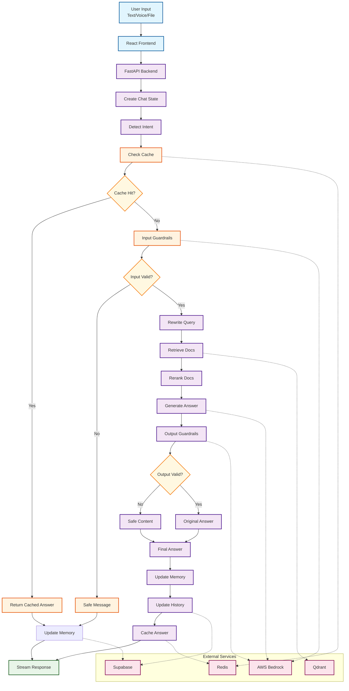

## Alternative View: System Architecture Flow

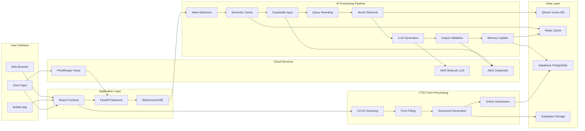

## 🔄 Chi Tiết Workflow LangGraph

### 1. Intent Detection (Phân Loại Ý Định)

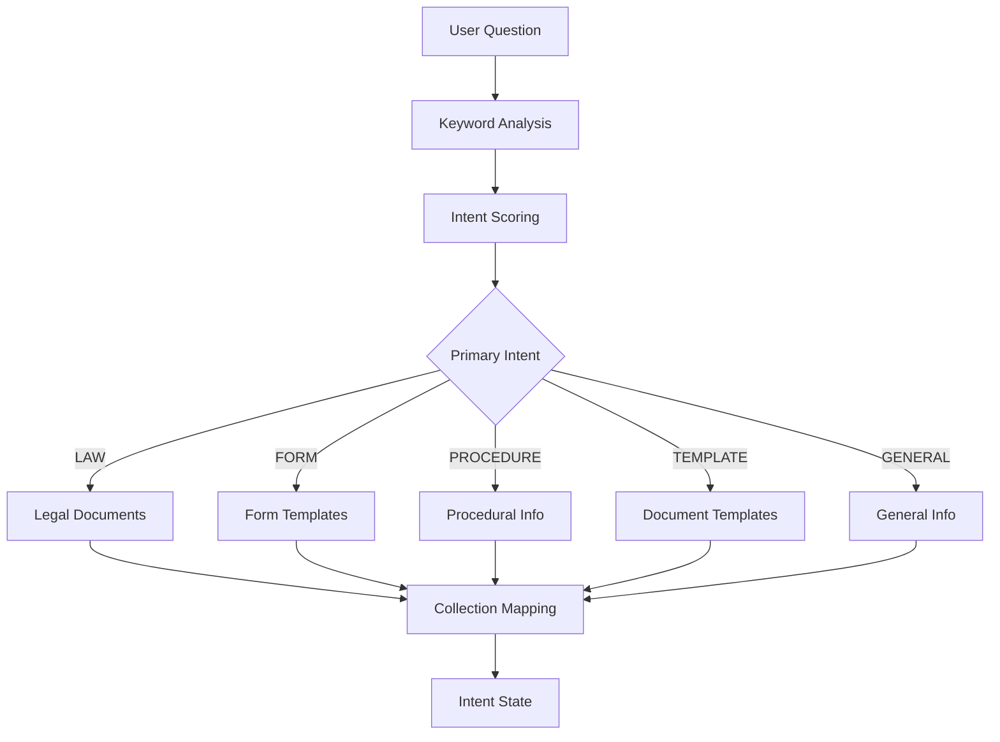

**Mô tả:**
- Phân tích từ khóa trong câu hỏi
- Tính điểm confidence cho từng loại intent
- Map intent đến collections tương ứng:
  - **LAW** → `legal_chunks`
  - **FORM** → `form_chunks`, `template_chunks`
  - **PROCEDURE** → `procedure_chunks`, `legal_chunks`
  - **TERM** → `legal_chunks`
  - **TEMPLATE** → `template_chunks`
  - **GENERAL** → `general_chunks`

### 2. Semantic Cache (Kiểm Tra Cache)

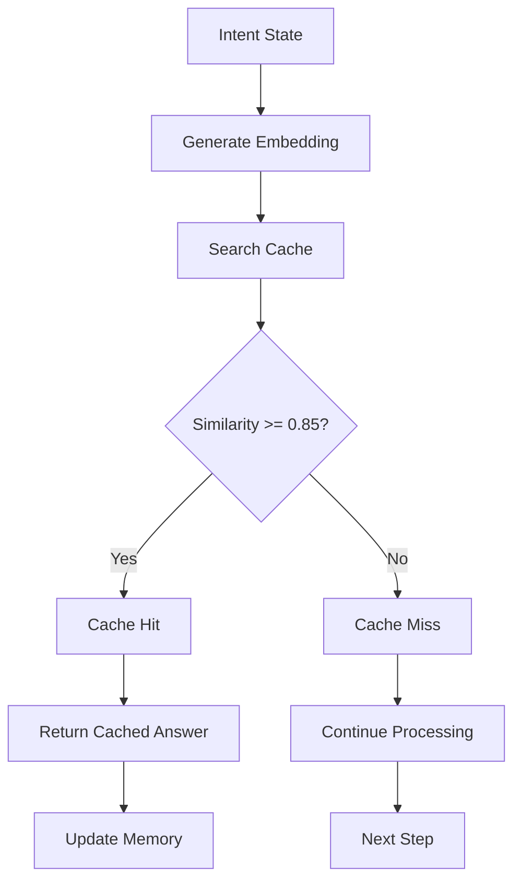

**Mô tả:**
- Tạo embedding của câu hỏi gốc
- So sánh với cache entries trong Redis
- Threshold: 0.85 similarity score
- Nếu cache hit: trả ngay kết quả, bỏ qua các bước sau

### 3. Guardrails Input (Kiểm Duyệt Đầu Vào)

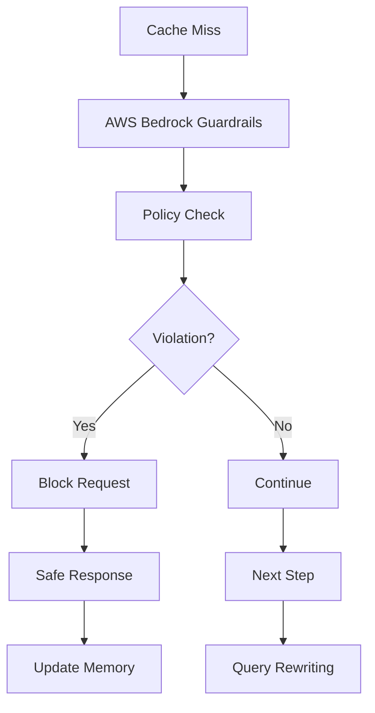

**Mô tả:**
- Sử dụng AWS Bedrock Guardrails
- Kiểm tra theo policy từ `policy_input.yaml`
- Chặn câu hỏi vi phạm chính sách an toàn
- Trả thông báo an toàn nếu vi phạm

### 4. Query Rewriting (Làm Sạch Câu Hỏi)

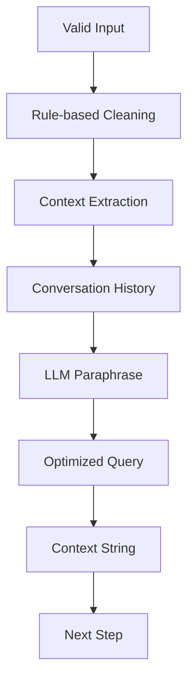

**Mô tả:**
- Làm sạch câu hỏi với rule-based cleaning
- Trích xuất context từ lịch sử hội thoại
- Sử dụng LLM để paraphrase nếu cần
- Tạo câu hỏi tối ưu cho tìm kiếm

### 5. Semantic Retrieval (Truy Xuất Thông Tin)

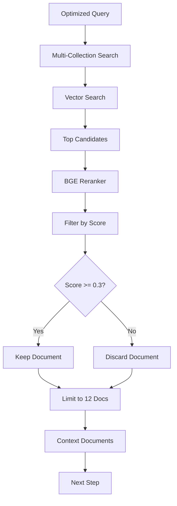

**Mô tả:**
- Tìm kiếm trong collections tương ứng với intent
- Lấy candidates từ mỗi collection (6-15 docs)
- Sử dụng BGE reranker để sắp xếp lại
- Lọc theo rerank_score >= 0.3
- Giới hạn final 12 documents

### 6. Answer Generation (Sinh Câu Trả Lời)

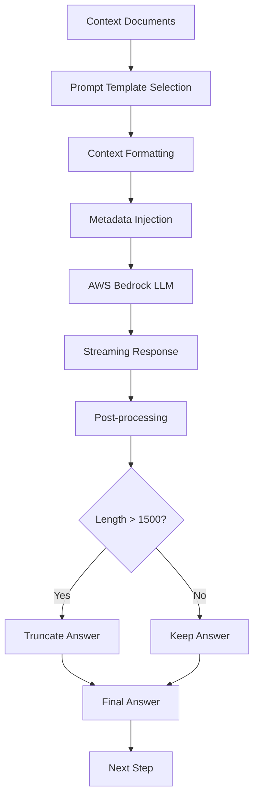

**Mô tả:**
- Chọn prompt template theo intent
- Tạo context trực tiếp từ documents và metadata
- Gọi AWS Bedrock (Llama 4 Scout 17B)
- Stream kết quả về frontend
- Post-processing: cắt bớt nếu quá dài

### 7. Output Validation (Kiểm Duyệt Đầu Ra)

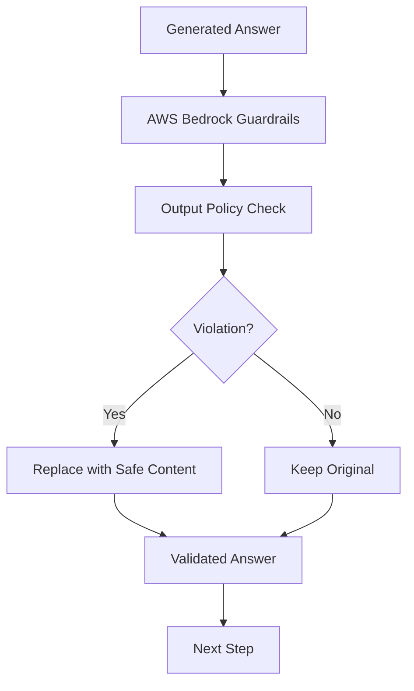

**Mô tả:**
- Sử dụng AWS Bedrock Guardrails
- Kiểm tra theo policy từ `policy_output.yaml`
- Thay thế nội dung vi phạm bằng thông báo an toàn

### 8. Memory Update (Cập Nhật Bộ Nhớ)

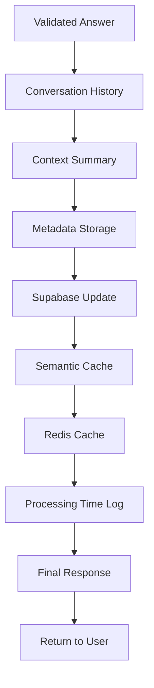

**Mô tả:**
- Cập nhật conversation history
- Tạo context summary cho lần sau
- Lưu metadata và processing time
- Cache kết quả mới cho semantic cache

## 🔄 Parallel Processing Workflow

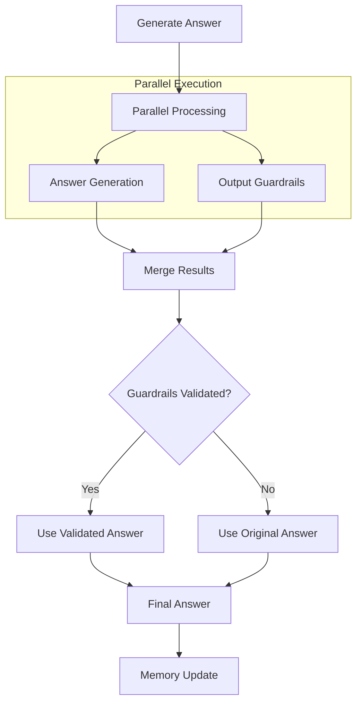

## 📊 Data Flow Diagram

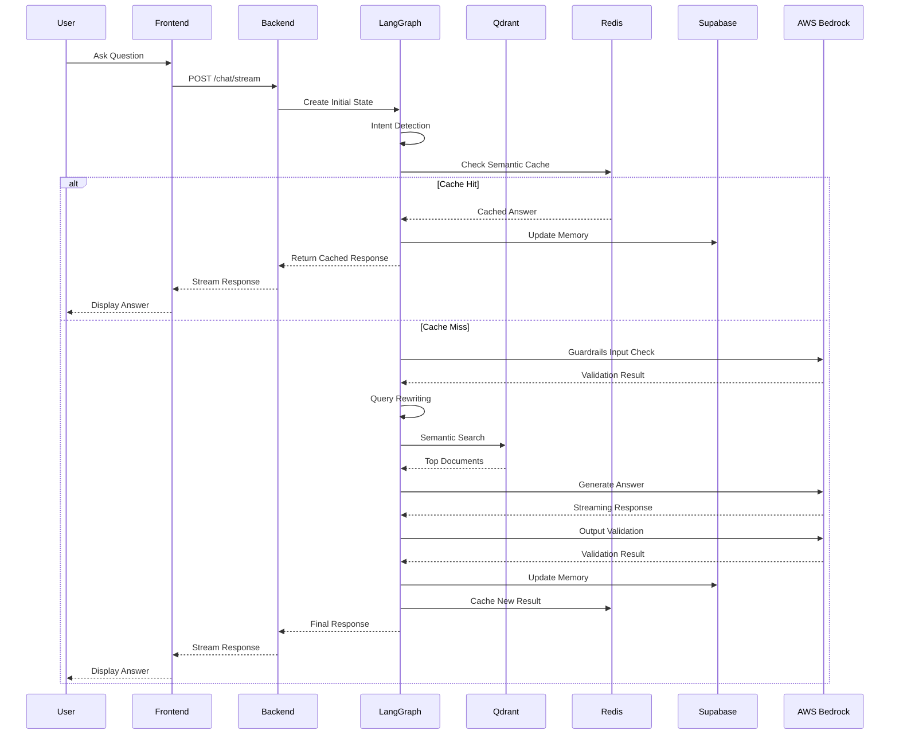

## 🎯 Decision Points & Error Handling

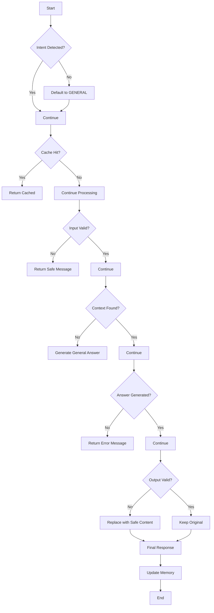

## 🔧 Configuration & State Management

### State Structure
```python
@dataclass
class ChatState:
    question: str
    messages: List[Dict]
    session_id: str
    intent: Optional[str] = None
    intent_confidence: Optional[float] = None
    all_intents: Optional[List[str]] = None
    cache_hit: Optional[bool] = None
    cache_answer: Optional[str] = None
    cache_sources: Optional[List] = None
    error: Optional[str] = None
    rewritten_query: Optional[str] = None
    context: Optional[str] = None
    sources: Optional[List] = None
    prompt: Optional[str] = None
    answer: Optional[str] = None
    final_answer: Optional[str] = None
    processing_time: Optional[float] = None
    guardrails_validated: Optional[bool] = None
    parallel_guardrails_completed: Optional[bool] = None
    generation_completed: Optional[bool] = None
```

### Workflow Configuration
```python
def create_rag_workflow():
    workflow = StateGraph(ChatState)
    
    # Add nodes
    workflow.add_node("set_intent", set_intent)
    workflow.add_node("semantic_cache", semantic_cache)
    workflow.add_node("guardrails_input", guardrails_input)
    workflow.add_node("rewrite", rewrite_query_with_context)
    workflow.add_node("retrieve", retrieve_context)
    workflow.add_node("generate", generate_answer)
    workflow.add_node("parallel_guardrails", parallel_guardrails_output)
    workflow.add_node("merge_results", merge_parallel_results)
    workflow.add_node("validate", validate_output)
    workflow.add_node("update_memory", update_memory)
    
    # Add edges
    workflow.add_edge(START, "set_intent")
    workflow.add_edge("set_intent", "semantic_cache")
    workflow.add_edge("semantic_cache", "guardrails_input")
    workflow.add_edge("guardrails_input", "rewrite")
    workflow.add_edge("rewrite", "retrieve")
    workflow.add_edge("retrieve", "generate")
    workflow.add_edge("generate", "parallel_guardrails")
    workflow.add_edge("parallel_guardrails", "merge_results")
    workflow.add_edge("generate", "merge_results")
    workflow.add_edge("merge_results", "validate")
    workflow.add_edge("validate", "update_memory")
    workflow.add_edge("update_memory", END)
    
    return workflow.compile()
```

## 📈 Performance Metrics

### Timing Breakdown
- **Intent Detection**: ~50ms
- **Semantic Cache**: ~100ms
- **Guardrails Input**: ~200ms
- **Query Rewriting**: ~150ms
- **Semantic Retrieval**: ~500ms
- **Answer Generation**: ~2000-5000ms
- **Output Validation**: ~200ms
- **Memory Update**: ~100ms

### Total Response Time
- **Cache Hit**: ~300ms
- **Cache Miss**: ~3-8 seconds

### Optimization Strategies
- **Semantic Caching**: Reduces response time by 80%
- **Parallel Processing**: Reduces validation time by 50%
- **Lazy Loading**: Reduces startup time
- **Connection Pooling**: Improves database performance

## 🔍 Monitoring & Logging

### Key Metrics
- Response time per step
- Cache hit/miss ratio
- Intent distribution
- Error rates
- User satisfaction scores

### Logging Strategy
- Structured logging with correlation IDs
- Performance metrics collection
- Error tracking and alerting
- User interaction analytics

---

**Lưu ý**: Workflow này được thiết kế để xử lý các câu hỏi pháp luật Việt Nam một cách hiệu quả và an toàn, với khả năng mở rộng và tùy chỉnh cao.
