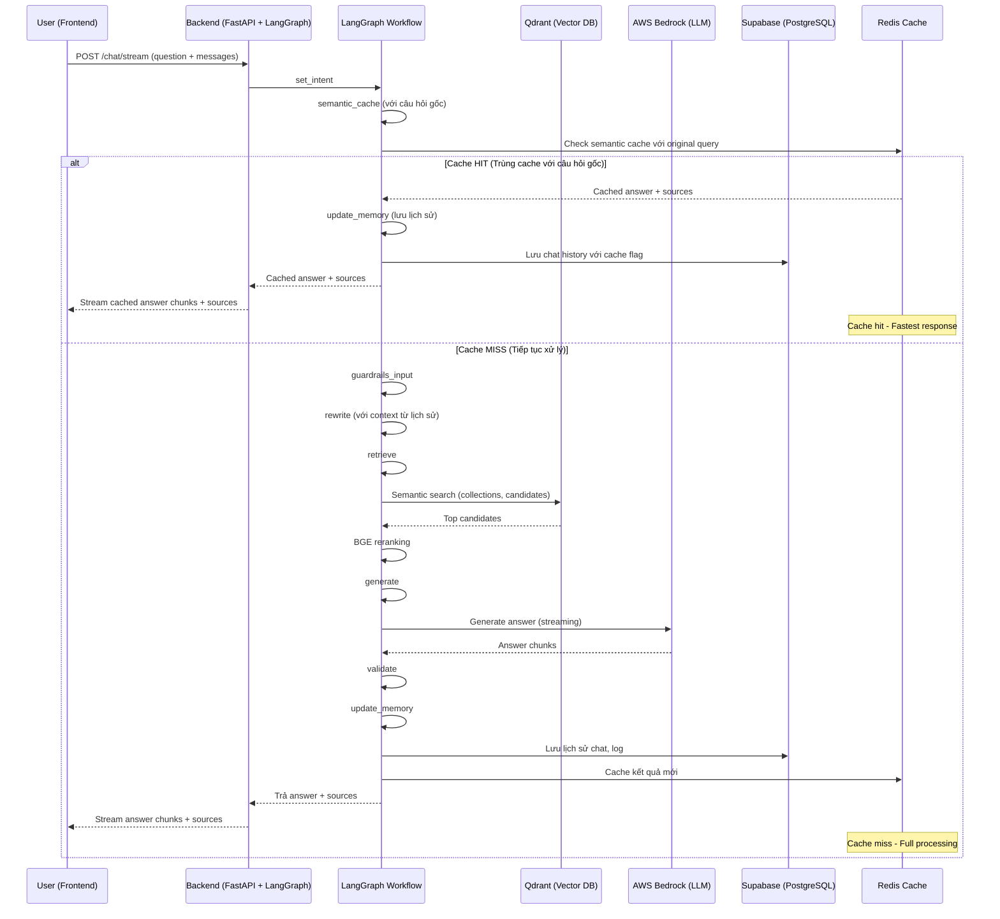

## 🛠️ Workflow Chi Tiết Toàn Bộ Hệ Thống Vietnamese Legal Chatbot

### 1. Luồng Xử Lý Tổng Thể (High-level System View)

```mermaid
graph TD

  %% Tầng giao diện ngÆ°á»i dùng chi tiết
  F1["Browser / Widget"] -->|HTTPS| F2["React App"] -->|REST / SSE| B1["FastAPI + LangGraph"]

  %% Dịch vụ phía sau
  B1 --> DB1["Postgres / Supabase"]
  B1 --> DB2["Qdrant Vector DB"]
  B1 --> DB3["Redis Cache"]
  B1 --> DB4["Supabase Storage"]

  %% LangGraph Agent Pipeline
  B1 --> C1["LangGraph Agent Pipeline"]

  subgraph C1 ["LangGraph Agent Pipeline"]
    direction TB
    C1A["Intent Detection"]
    C1B["Semantic Cache Check"]
    C1C["Guardrails Input"]
    C1D["Query Rewriting"]
    C1E["Semantic Retrieval"]
    C1F["Answer Generation"]
    C1G["Output Validation"]
    C1H["Memory Update"]
    
    C1A --> C1B --> C1C --> C1D --> C1E --> C1F --> C1G --> C1H
  end

  %% Output
  C1H --> D1["Stream Response to Frontend"] --> F1
```


### 2. Mô tả chi tiết từng bước

**A. Frontend (React 18)**
- Người dùng nhập câu hỏi và gửi request qua API `/chat/stream`.
- Gửi kèm mảng `messages` chứa lịch sử hội thoại.
- **Nhận kết quả trả về dạng streaming:**
  - Các chunk `"type": "chunk"` chứa nội dung trả lời.
  - Chunk `"type": "sources"` chứa metadata nguồn tham khảo (bao gồm cả file mẫu, link tải về...).
  - Chunk `"type": "done"` báo hiệu kết thúc stream.
- **Hiển thị:**
  - Nội dung trả lời real-time từng chunk.
  - Nếu có file mẫu trong sources, **hiện nút tải về nổi bật** phía dưới.
  - Khi bấm "Hiện nguồn tham khảo", hiển thị đúng thông tin nguồn (luật hoặc biểu mẫu, có link tải nếu là mẫu).
- **Tính năng bổ sung:**
  - Voice-to-text với PhoWhisper model
  - CT01 form filling modal
  - CCCD scanning
  - Chat history management

**B. Backend (FastAPI + LangGraph)**
- Nhận request, sinh `session_id` nếu chưa có, chuẩn hóa lịch sử hội thoại.
- **LangGraph RAG Workflow:**

#### Bước 1: Phân loại ý định (Intent Detection)
- **set_intent:** Phân loại intent (law, form, term, procedure, template, general).
- **Logic:** Sử dụng keyword-based detection với confidence scoring.
- **Output:** Primary intent và danh sách tất cả intents có thể.
- **Collections mapping:**
  - LAW → legal_chunks
  - FORM → form_chunks, template_chunks  
  - TERM → legal_chunks
  - PROCEDURE → procedure_chunks, legal_chunks, template_chunks
  - TEMPLATE → template_chunks
  - GENERAL → general_chunks

#### Bước 2: Kiểm tra semantic cache
- **semantic_cache:** Kiểm tra cache semantic với câu hỏi gốc.
- **Logic:** Tạo embedding của câu hỏi, so sánh với cache entries trong Redis.
- **Threshold:** 0.85 similarity score.
- **Nếu cache hit:** Trả ngay kết quả và sources, bỏ qua các bước sau.

#### Bước 3: Kiểm duyệt an toàn đầu vào
- **guardrails_input:** Kiểm duyệt an toàn đầu vào (AWS Bedrock Guardrails).
- **Logic:** Sử dụng AWS Bedrock Guardrails với policy từ `policy_input.yaml`.
- **Nếu vi phạm:** Trả về thông báo an toàn, không xử lý tiếp.

#### Bước 4: Làm sạch & cải thiện câu hỏi
- **rewrite:** Làm sạch, paraphrase câu hỏi với context từ lịch sử hội thoại.
- **Logic:** Kết hợp rule-based cleaning và LLM paraphrase nếu cần.
- **Context:** Sử dụng conversation history để hiểu ngữ cảnh.
- **Output:** Câu hỏi đã được rewrite và context string.

#### Bước 5: Truy xuất thông tin semantic
- **retrieve:** Tìm kiếm semantic trong các collection tương ứng.
- **Logic:** 
  - Dựa trên tất cả intents để chọn collections.
  - Tìm kiếm top candidates từ mỗi collection (6-15 docs tùy số collections).
  - Sử dụng BGE reranker để sắp xếp lại kết quả.
  - Lọc theo rerank_score >= 0.3.
  - Giới hạn final 12 docs.
- **Output:** Top context documents.

#### Bước 6: Tạo prompt động & sinh câu trả lời
- **generate:** Tạo prompt động phù hợp intent, chèn context và metadata.
- **Logic:**
  - Chọn prompt template theo intent.
  - Format context documents với metadata.
  - Gọi AWS Bedrock (Llama 4 Scout 17B) để sinh câu trả lời.
  - Stream kết quả về frontend từng chunk.
  - Post-processing: cắt bớt nếu câu trả lời quá dài (>1500 chars).
- **Output:** Câu trả lời hoàn chỉnh và prompt để streaming.

#### Bước 7: Kiểm duyệt đầu ra
- **validate:** Kiểm duyệt đầu ra (AWS Bedrock Guardrails).
- **Logic:** Sử dụng AWS Bedrock Guardrails với policy từ `policy_output.yaml`.
- **Nếu vi phạm:** Thay thế bằng thông báo an toàn.

#### Bước 8: Cập nhật bộ nhớ & cache
- **update_memory:** Lưu lại câu hỏi, câu trả lời, nguồn, intent, v.v. vào Supabase.
- **Logic:**
  - Cập nhật conversation history.
  - Tạo context summary.
  - Lưu metadata và processing time.
- **Cache:** Lưu kết quả mới vào semantic cache cho lần sau.

### 3. Sơ Đồ Luồng Dữ Liệu Chi Tiết (Data Flow, LangGraph-based)



### 4. Giải thích từng bước workflow

#### **Bước 1: Intent Detection (Phân loại ý định)**
- **Mục đích:** Xác định loại câu hỏi để chọn đúng nguồn dữ liệu và cách trả lời.
- **Hoạt động:** Phân tích từ khóa trong câu hỏi, tính điểm confidence cho từng loại intent.
- **Kết quả:** Primary intent và danh sách tất cả intents có thể để tìm kiếm toàn diện.
- **Collections mapping:** Mỗi intent được map đến các collections phù hợp.

#### **Bước 2: Semantic Cache Check (Kiểm tra cache)**
- **Mục đích:** Tăng tốc độ phản hồi cho câu hỏi tương tự đã được trả lời trước đó.
- **Hoạt động:** Tạo embedding của câu hỏi, so sánh với cache entries trong Redis.
- **Kết quả:** Nếu tìm thấy câu hỏi tương tự (similarity ≥ 0.85), trả ngay kết quả cache.

#### **Bước 3: Guardrails Input (Kiểm duyệt đầu vào)**
- **Mục đích:** Đảm bảo câu hỏi không vi phạm chính sách an toàn.
- **Hoạt động:** Sử dụng AWS Bedrock Guardrails để kiểm tra nội dung câu hỏi.
- **Kết quả:** Chặn câu hỏi vi phạm và trả thông báo an toàn.

#### **Bước 4: Query Rewriting (Làm sạch câu hỏi)**
- **Mục đích:** Cải thiện câu hỏi để tăng độ chính xác khi tìm kiếm.
- **Hoạt động:** Làm sạch câu hỏi, bổ sung context từ lịch sử hội thoại.
- **Kết quả:** Câu hỏi đã được tối ưu hóa cho việc tìm kiếm.

#### **Bước 5: Semantic Retrieval (Truy xuất thông tin)**
- **Mục đích:** Tìm các tài liệu liên quan nhất để trả lời câu hỏi.
- **Hoạt động:** 
  - Tìm kiếm trong các collection tương ứng với intent.
  - Lấy candidates từ mỗi collection (6-15 docs tùy số collections).
  - Sử dụng BGE reranker để sắp xếp lại theo độ phù hợp.
  - Lọc theo rerank_score >= 0.3.
  - Giới hạn final 12 docs.
- **Kết quả:** Top context documents có độ phù hợp cao nhất.

#### **Bước 6: Answer Generation (Sinh câu trả lời)**
- **Mục đích:** Tạo câu trả lời chính xác và hữu ích dựa trên context.
- **Hoạt động:**
  - Tạo prompt động theo intent và context.
  - Gọi LLM (Llama 4 Scout 17B) để sinh câu trả lời.
  - Stream kết quả về frontend từng chunk.
  - Post-processing: cắt bớt nếu quá dài.
- **Kết quả:** Câu trả lời hoàn chỉnh và prompt để streaming.

#### **Bước 7: Output Validation (Kiểm duyệt đầu ra)**
- **Mục đích:** Đảm bảo câu trả lời không chứa nội dung nhạy cảm.
- **Hoạt động:** Sử dụng AWS Bedrock Guardrails để kiểm tra nội dung trả lời.
- **Kết quả:** Thay thế nội dung vi phạm bằng thông báo an toàn.

#### **Bước 8: Memory Update (Cập nhật bộ nhớ)**
- **Mục đích:** Lưu trữ thông tin để cải thiện trải nghiệm và phân tích.
- **Hoạt động:**
  - Cập nhật conversation history.
  - Tạo context summary cho lần sau.
  - Lưu metadata và thời gian xử lý từng bước.
  - Cache kết quả mới cho lần sau.
- **Kết quả:** Dữ liệu được lưu trữ để tracking và cải thiện hệ thống về sau.

### 5. Cấu trúc Hệ Thống

#### **Backend Architecture**
```
backend/
├── agents/
│   ├── nodes/           # LangGraph workflow nodes
│   ├── utils/           # Utility functions
│   ├── guardrails/      # AWS Bedrock Guardrails
│   ├── prompt/          # Prompt templates
│   ├── workflow.py      # Main workflow definition
│   └── state.py         # ChatState definition
├── services/
│   ├── llm_service.py   # AWS Bedrock integration
│   ├── qdrant_service.py # Vector database
│   ├── cache_service.py # Redis cache
│   └── reranker_service.py # BGE reranker
├── embeddings/
│   ├── sentence_transformer.py # HuggingFace embeddings
│   └── bedrock_embeddings.py  # AWS Titan embeddings
├── routers/
│   ├── langgraph_chat.py # Main chat endpoints
│   ├── voice_to_text.py  # Voice transcription
│   └── ct01.py          # CT01 form handling
└── configs/
    ├── settings.py      # Application settings
    └── configs.yaml     # Configuration file
```

#### **Frontend Architecture**
```
frontend/src/
├── components/
│   ├── FloatingChatbot.js    # Main chat interface
│   ├── Message.js            # Message display
│   ├── MessageInput.js       # Input handling
│   ├── VoiceRecorder.js      # Voice input
│   ├── CT01Modal.js          # Form filling modal
│   └── CT01Form.js           # CT01 form component
├── hooks/
│   ├── useChatStream.js      # Chat streaming logic
│   └── useVoiceToText.js     # Voice transcription
└── services/                 # API services
```

### 9. Tính Năng Bổ Sung

#### **Voice-to-Text**
- **Model:** PhoWhisper-medium cho tiếng Việt
- **Real-time:** Streaming transcription
- **Integration:** Tự động gửi text sau khi transcribe

#### **CT01 Form Filling**
- **Modal Interface:** Giao diện điền form trực quan
- **OCR Integration:** Quét CCCD tự động
- **Validation:** Kiểm tra dữ liệu real-time
- **Preview:** Xem trước form trước khi submit

#### **Multi-modal Support**
- **Text Input:** Chat truyền thống
- **Voice Input:** Ghi âm và transcribe
- **File Upload:** Upload documents
- **Image Recognition:** Quét CCCD
